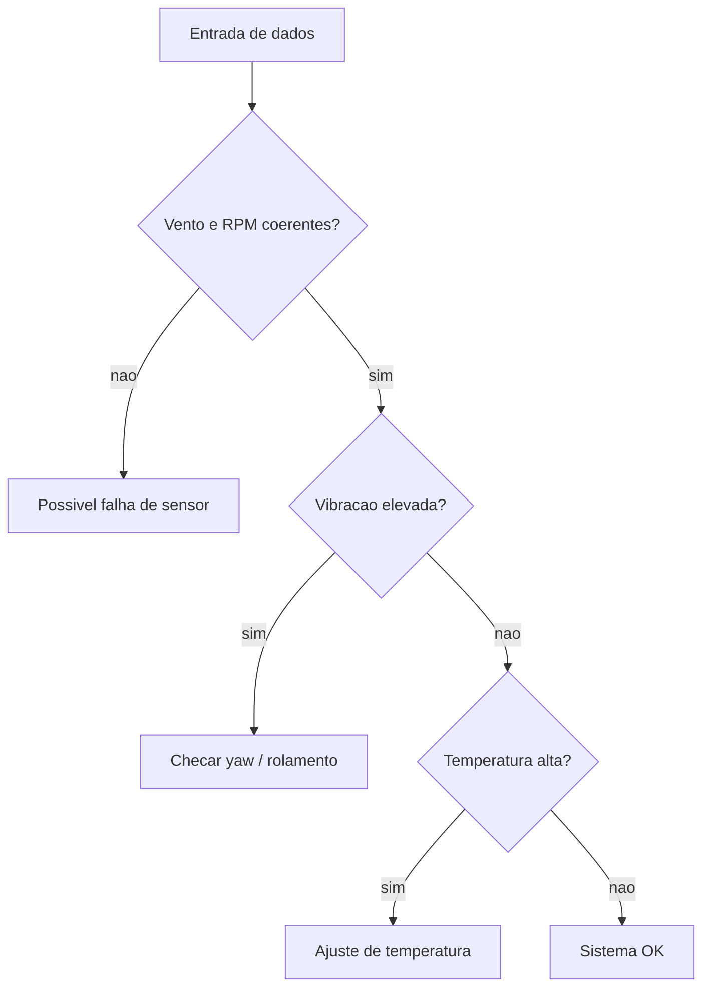

# Contexto

Esse projeto foi pensado para apoiar tecnicos de manutencao em fazendas eolicas, ajudando a identificar
condicoes anormais a partir de medições da turbina.

O sistema avalia variaveis como vento, rpm, vibracao, temperatura, pressao e consumo para sugerir um diagnostico
automatico com explicacao.

## Como funciona

1. Um evento contem o conjunto de medições da turbina.
2. O motor de regras compara os valores com os limites esperados.
3. O sistema retorna um diagnostico e uma justificativa.

## Principais regras

- **RPM muito baixo com vento fora do normal**: possivel falha de sensor ou atuador.
- **Pressao hidraulica das pas fora do normal**: possivel vazamento ou ar no oleo.
- **Torque fora do padrao**: possivel erro de calibracao.
- **Vibracao alta com temperatura do oleo normal**: verificar sistema de yaw.
- **Temperatura do oleo alta com vibracao normal**: ajuste de temperatura.
- **Pressao do oleo lubrificante fora do normal**: possivel vazamento ou problema na bomba.
- **Vibracao, temperatura e ruido elevados**: possivel falha em rolamento.
- **Consumo eletrico anormal**: possivel erro mecanico.
- **Potencia incoerente com o vento**: possivel erro de sensor.

## Exemplo de saida

```text
Diagnostico: Falha de sensor ou atuador
Motivo: RPM muito baixo com vento fora do normal.
Acao sugerida: verificar sensor de velocidade e sistema de controle.
```

## Fluxograma



## Observacao

Esse projeto funciona muito bem como case no portfólio porque mostra raciocinio baseado em regras,
diagnostico explicavel e foco em manutencao industrial.
